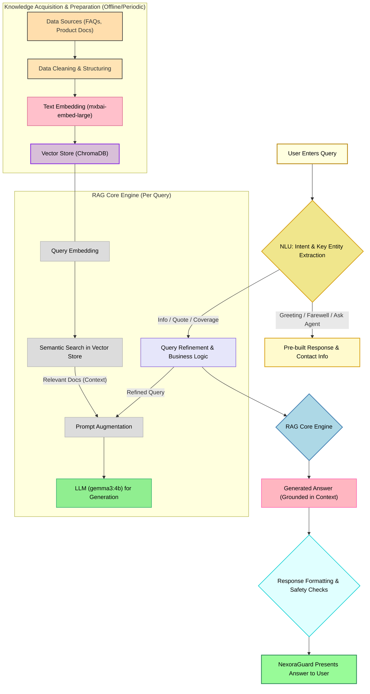

<div align="center">

# 🚀 NexoraGuard: Your Intelligent Customer Service Assistant 🚀

[](https://www.python.org/downloads/)
[](#) <!-- Replace with actual Streamlit link if applicable -->
[](#)
[](#)
[](LICENSE) <!-- Add a LICENSE file if you have one -->

**NexoraGuard is a state-of-the-art, RAG-powered chatbot designed to revolutionize your customer service experience. It intelligently understands user queries, fetches relevant information from your knowledge base, and provides accurate, context-aware responses. And its completely local!**

</div>

---

## ✨ Key Features

*   🧠 **Advanced RAG Architecture:** Combines the power of retrieval with generative AI for precise and informative answers.
*   📚 **Knowledge Base Integration:** Seamlessly connects with your FAQs, product documentation, and other data sources.
*   🎯 **Intent & Entity Recognition:** Accurately understands user intent and extracts key information from queries.
*   💬 **Natural Language Understanding & Generation:** Engages users in natural, human-like conversations.
*   ⚡ **Fast & Scalable:** Built with performance in mind, leveraging ChromaDB for efficient vector search and a robust LLM (gemma3:4b or fine-tuned Gemma 8B via SageMaker).
*   🛠️ **Modular Design:** Easily customizable and extensible to fit your specific needs.
*   ☁️ **Cloud-Ready (Conceptual):** Designed with a conceptual MLOps pipeline for AWS, including components like SageMaker, ECS Fargate, and CloudWatch for robust deployment and monitoring.

---

## 🔧 Getting Started

Follow these steps to get NexoraGuard up and running on your local machine.

### Prerequisites

*   Python 3.10 or higher
*   `uv` (Python package installer and virtual environment manager)

### Installation & Setup

1.  **Clone the repository (if you haven't already):**
    ```powershell
    git clone https://github.com/tatkaal/NexoraGuard.git
    cd NexoraGuard
    ```

2.  **Create and activate a virtual environment using `uv`:**
    ```powershell
    uv venv
    # On Windows
    .venv\Scripts\Activate.ps1
    # On macOS/Linux
    # source .venv/bin/activate
    ```

3.  **Install the required dependencies using `uv`:**
    ```powershell
    uv pip install -r requirements.txt
    ```

4.  **Set up necessary configurations:**
    *   Ensure your knowledge base files (e.g., FAQs, product documents) are in the designated `data` directory (or configure the path as needed).
    *   Ensure you have pulled the gemma3:4b and mxbai-embed-large model from ollama (ollama pull gemma3:4b mxbai-embed-large)
    *   Configure any API keys or model endpoints if you are using external services (e.g., OpenAI/Anthropic if not run locally).

5.  **Run the application (example using Streamlit, adjust if different):**
    The project includes an `app.py` which appears to run a Streamlit application.
    ```powershell
    streamlit run app.py
    ```

---

## ⚙️ Project Structure (Conceptual Overview)

NexoraGuard follows a modular architecture:

```
.
├── data/                     # Your knowledge base (FAQs, product docs)
├── nexora_chroma_vector_store/ # ChromaDB vector store
├── utilities/                # Utility scripts and helper functions
├── app.py                    # Main application file (e.g., Streamlit app)
├── nexora_rag.py             # Core RAG logic and chatbot implementation
├── nexora.ipynb              # Jupyter notebook for development and experimentation
├── nexora_conceptual.ipynb   # Jupyter notebook detailing MLOps and fine-tuning
├── requirements.txt          # Python dependencies
├── pyproject.toml            # Project metadata and build system configuration
├── uv.lock                   # Lock file for uv
└── README.md                 # You are here!
```

---

## 🌊 Workflow Overview

<div align="center">

*The diagram below illustrates the core RAG process within NexoraGuard.*


</div>

For a more detailed MLOps pipeline concept involving AWS services like SageMaker for fine-tuning, ECR, ECS Fargate, and monitoring with CloudWatch, please refer to the `nexora_conceptual.ipynb` notebook.

---

## 💡 Future Enhancements & Roadmap

*   **Advanced Fine-Tuning:** Implement the LoRA fine-tuning pipeline (as conceptualized in `nexora_conceptual.ipynb`) using SageMaker for improved tone, domain-specific jargon, and reduced hallucinations.
*   **User Feedback Loop:** Integrate a system for collecting user feedback (thumbs up/down) to continuously improve responses and schedule re-training/fine-tuning jobs.
*   **Multi-lingual Support:** Extend capabilities to support multiple languages.
*   **Enhanced UI/UX:** Develop a more sophisticated user interface with features like chat history, user accounts, and administrative dashboards.
*   **Comprehensive Monitoring:** Full implementation of CloudWatch metrics and Grafana/QuickSight dashboards for performance and SLA tracking.
*   **Automated Evaluation:** Set up automated evaluation pipelines for model performance using metrics like BLEU, ROUGE-L, and grounding scores.

---

## 🤝 Contributing

Contributions are welcome! If you have ideas for improvements or want to contribute to the development of NexoraGuard, please feel free to:

1.  Fork the repository.
2.  Create a new branch (`git checkout -b feature/YourAmazingFeature`).
3.  Make your changes.
4.  Commit your changes (`git commit -m 'Add some AmazingFeature'`).
5.  Push to the branch (`git push origin feature/YourAmazingFeature`).
6.  Open a Pull Request.

Please ensure your code adheres to the project's coding standards and includes relevant tests.

---

## 📜 License

This project is licensed under the MIT License - see the `LICENSE` file for details (if one exists, otherwise consider adding one).

---

<div align="center">
Made with ❤️ and 🤖 by the Tatkaal Team
</div>
